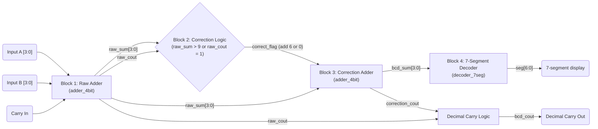

# ce2032-vlsi-bcd-adder
RTL design and physical implementation of a 4-bit BCD Adder with 7-Segment Decoder

## Block diagram

`correct_flag` selects the correction operand for the second adder: `4'd6` when
the raw binary sum is not a valid BCD digit, otherwise `4'd0`. `bcd_cout` is
`raw_cout | correction_cout`, the carry into the decimal tens digit.
