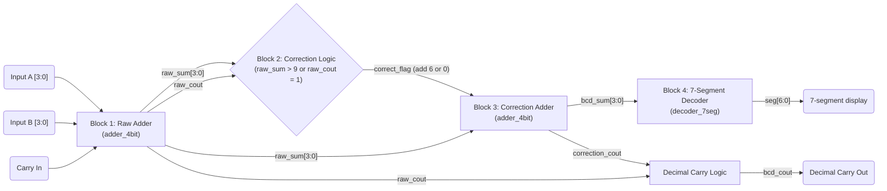

# ce2032-vlsi-bcd-adder
RTL design and physical implementation of a 4-bit BCD Adder with 7-Segment Decoder

## Block diagram



`correct_flag` selects the correction operand for the second adder: `4'd6` when
the raw binary sum is not a valid BCD digit, otherwise `4'd0`. `bcd_cout` is
`raw_cout | correction_cout`, the carry into the decimal tens digit.

## Simulation and waveform viewing

The self-checking testbench validates these directed cases before exhaustively
testing all 200 valid BCD input combinations (`A` and `B` from 0 to 9, with
`Cin` equal to 0 or 1):

1. `3 + 4 + 0 = 7`
2. `5 + 5 + 0 = 10` (BCD correction)
3. `9 + 9 + 1 = 19` (maximum input case)
4. Invalid BCD value `12` to the 7-segment decoder (all segments off)

Compile and run with Icarus Verilog:

```powershell
iverilog -g2012 -s tb_top_bcd_adder -o bcd_adder_test.vvp adder_4bit.sv correction_logic.sv decoder_7seg.sv top_bcd_adder.sv tb_top_bcd_adder.sv
vvp bcd_adder_test.vvp
```

The simulation writes `bcd_adder_waveform.vcd`. Open it in GTKWave:

```powershell
gtkwave bcd_adder_waveform.vcd
```

For debugging, inspect `a`, `b`, `cin`, `bcd_sum`, `bcd_cout`, `seg`, and the
internal signals `raw_sum`, `raw_cout`, `correct_flag`, `correction_value`, and
`correction_cout` under `dut`.
